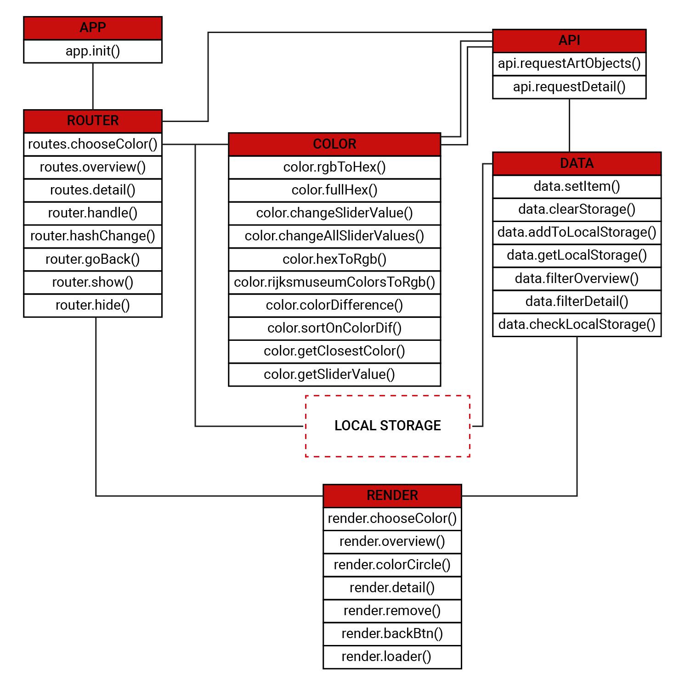

# 🎓 Web App From Scratch 👨🏻‍💻 Marten de Bruijn

### Live Demo

[Bekijk de live demo!](https://martendebruijn.github.io/web-app-from-scratch-1920/)

## Beschrijving

Door middel van deze web applicatie kan men het rijksmuseum doorzoeken op basis van een kleur.

## Installeren

```
git clone https://github.com/martendebruijn/web-app-from-scratch-1920.git
```

## API

Bij deze applicatie maak ik gebruik van de API van het Rijksmuseum. Deze API is een set van meer dan 110,000 beschrijvingen en digitale afbeeldingen van kunstobjecten van de collectie van het Rijksmuseum. De kunstwerken dateren van lang geleden tot eind 19e eeuw. Vanwege copyright restricties zijn kunstwerken van de 20e en 21e eeuw niet toegevoegd in deze API.

Om gebruik te maken van de API van het Rijksmuseum heeft men een key nodig. Deze kan men aanvragen bij de gevanceerde account instellingen op de site van het Rijksumseum.
https://www.rijksmuseum.nl/en/rijksstudio/

Er zijn twee api calls mogelijk:

1. Collection API: het zoeken op de gehele collectie
2. Collection Details API: het zoeken op een specifiek kunst object

Bij het zoeken op een specifiek kunst object komt meer data terug over het object dan wanneer men zoekt op de gehele collectie.

## Data

### Collection API

Uit de collection API komt de volgende data:

#### Example response Collection API

```
{
  "elapsedMilliseconds": 0,
  "count": 3491,
  "artObjects": [
    {
      "links": {
        "self": "http://www.rijksmuseum.nl/api/nl/collection/SK-C-5",
        "web": "http://www.rijksmuseum.nl/nl/collectie/SK-C-5"
      },
      "id": "nl-SK-C-5",
      "objectNumber": "SK-C-5",
      "title": "De Nachtwacht",
      "hasImage": true,
      "principalOrFirstMaker": "Rembrandt van Rijn",
      "longTitle": "De Nachtwacht, Rembrandt van Rijn, 1642",
      "showImage": true,
      "permitDownload": true,
      "webImage": {
          "guid": "aa08df9c-0af9-4195-b31b-f578fbe0a4c9",
          "offsetPercentageX": 0,
          "offsetPercentageY": 1,
          "width": 2500,
          "height": 2034,
          "url":"https://lh3.googleusercontent.com/J-mxAE7CPu-DXIOx4QKBtb0GC4ud37da1QK7CzbTIDswmvZHXhLm4Tv2-1H3iBXJWAW_bHm7dMl3j5wv_XiWAg55VOM=s0"
      },
      "headerImage": {
        "guid": "29a2a516-f1d2-4713-9cbd-7a4458026057",
        "offsetPercentageX": 0,
        "offsetPercentageY": 0,
        "width": 1920,
        "height": 460,
        "url": "https://lh3.googleusercontent.com/O7ES8hCeygPDvHSob5Yl4bPIRGA58EoCM-ouQYN6CYBw5jlELVqk2tLkHF5C45JJj-5QBqF6cA6zUfS66PUhQamHAw=s0"
      },
      "productionPlaces": ["Amsterdam"]
    },
    // more results...
  ]
}
```

Na het verkrijgen van deze data wordt de data gefilterd zodat onderstaand over blijft:

```
"0": [
        id: "SK-A-2963"
        title: "Portret van Don Ramón Satué"
        maker: "Francisco de Goya"
        imgUrl: "https://lh3.googleusercontent.com/SwwiVAxnwFE_s-k7-bPOZ6jnGfcuVDJoZ-ofLb0Zispb-mJdsfasrE1nTPRcGDPwyEqY0txKpjPcAWaIIltYvvPtDA8=s0"
    ]

    //more results
```

#### Example response Collection Detail API

Uit de collection detail API komt de volgende data:

```
{
  "elapsedMilliseconds": 219,
  "artObject": {
    "links": {
      "search":"http://www.rijksmuseum.nl/api/nl/collection"
    },
    "id": "nl-SK-C-5",
    "priref": "5216",
    "objectNumber": "SK-C-5",
    "language": "nl",
    "title": "De Nachtwacht",
    "copyrightHolder": null,
    "webImage":{
      "guid": "aa08df9c-0af9-4195-b31b-f578fbe0a4c9",
      "offsetPercentageX": 50,
      "offsetPercentageY": 100,
      "width": 2500,
      "height": 2034,
     "url": "https://lh3.googleusercontent.com/J-mxAE7CPu-DXIOx4QKBtb0GC4ud37da1QK7CzbTIDswmvZHXhLm4Tv2-1H3iBXJWAW_bHm7dMl3j5wv_XiWAg55VOM=s0"
    },
    "colors": [
      {
        "percentage": 81,
        "hex": "#261808"
      },
      // more results...
    ],
    "colorsWithNormalization": [
      {
        "originalHex": "#261808",
        "normalizedHex": "#000000"
      },
      // more results...
    ],
    "normalizedColors": [
      {
        "percentage": 81,
        "hex": "#000000"
      },
      // more results...
    ],
    "normalized32Colors": [
      {
        "percentage": 81,
        "hex": "#000000"
      },
      // more results...
    ],
    "titles": [
       "Officieren en andere schutters van wijk II in Amsterdam, onder leiding van kapitein Frans Banninck Cocq en luitenant Willem van Ruytenburch, bekend als ‘De Nachtwacht’",
         "Het korporaalschap van kapitein Frans Banninck Cocq en luitenant Willem van Ruytenburch, bekend als de 'Nachtwacht'"
    ],
    "description": "Officieren en andere schutters van wijk II in Amsterdam onder leiding van kapitein Frans Banninck Cocq en luitenant Willem van Ruytenburch, sinds het einde van de 18de eeuw bekend als ‘De Nachtwacht’. Schutters van de Kloveniersdoelen uit een poort naar buiten tredend. Op een schild aangebracht naast de poort staan de namen van de afgebeelde personen: Frans Banning Cocq, heer van purmerlant en Ilpendam, Capiteijn Willem van Ruijtenburch van Vlaerdingen, heer van Vlaerdingen, Lu[ij]tenant, Jan Visscher Cornelisen Vaendrich, Rombout Kemp Sergeant, Reijnier Engelen Sergeant, Barent Harmansen, Jan Adriaensen Keyser, Elbert Willemsen, Jan Clasen Leydeckers, Jan Ockersen, Jan Pietersen bronchorst, Harman Iacobsen wormskerck, Jacob Dircksen de Roy, Jan vander heede, Walich Schellingwou, Jan brugman, Claes van Cruysbergen, Paulus Schoonhoven. De schutters zijn gewapend met onder anderen pieken, musketten en hellebaarden. Rechts de tamboer met een grote trommel. Tussen de soldaten links staat een meisje met een dode kip om haar middel, rechts een blaffende hond. Linksboven de vaandrig met de uitgestoken vaandel.",
    "labelText": null,
    "objectTypes": [
      "schilderij"
    ],
    "objectCollection": [
      "schilderijen"
    ],
    "makers": [ ],
    "principalMakers": [
      {
        "name": "Rembrandt van Rijn",
        "unFixedName": "Rijn, Rembrandt van",
        "placeOfBirth": "Leiden",
        "dateOfBirth": "1606-07-15",
        "dateOfBirthPrecision": null,
        "dateOfDeath": "1669-10-08",
        "dateOfDeathPrecision": null,
        "placeOfDeath": "Amsterdam",
        "occupation": [
          "prentmaker",
          "tekenaar",
          "schilder"
        ],
        "roles":[
          "schilder"
        ],
        "nationality": "Noord-Nederlands",
        "biography": null,
        "productionPlaces": [
          "Amsterdam"
        ],
        "qualification": null
      }
    ],
    "plaqueDescriptionDutch": "Rembrandts beroemdste en grootste doek werd gemaakt voor de Kloveniersdoelen. Dit was een van de verenigingsgebouwen van de Amsterdamse schutterij, de burgerwacht van de stad. \r\nRembrandt was de eerste die op een groepsportret de figuren in actie weergaf. De kapitein, in het zwart, geeft zijn luitenant opdracht dat de compagnie moet gaan marcheren. De schutters stellen zich op. Met behulp van licht vestigde Rembrandt de aandacht op belangrijke details, zoals het handgebaar van de kapitein en het kleine meisje op de achtergrond. Zij is de mascotte van de schutters.",
    "plaqueDescriptionEnglish": "Rembrandt’s largest, most famous canvas was made for the Arquebusiers guild hall. This was one of several halls of Amsterdam’s civic guard, the city’s militia and police. \r\nRembrandt was the first to paint figures in a group portrait actually doing something. The captain, dressed in black, is telling his lieutenant to start the company marching. The guardsmen are getting into formation. Rembrandt used the light to focus on particular details, like the captain’s gesturing hand and the young girl in the foreground. She was the company mascot.\r\n",
    "principalMaker": "Rembrandt van Rijn",
    "artistRole": null,
    "associations": [ ],
    "acquisition": {
      "method": "bruikleen",
      "date": "1808-01-01T00:00:00",
      "creditLine": "Bruikleen van de gemeente Amsterdam"
    },
    "exhibitions": [ ],
    "materials": [
      "doek",
      "olieverf"
    ],
    "techniques":[ ],
    "productionPlaces": [
      "Amsterdam"
    ],
    "dating":{
      "presentingDate": "1642",
      "sortingDate": 1642,
      "period": 17,
      "yearEarly": 1642,
      "yearLate": 1642
    },
    "classification": {
      "iconClassIdentifier": [
        "45(+26)",
        // more results...
      ],
      // more results...
    },
    "hasImage": true,
    "historicalPersons": [
      "Banninck Cocq, Frans",
      // more results...
    ],
    "inscriptions": [ ],
    "documentation": [
      "The Rembrandt Database,  Object information, Rembrandt,  Civic guardsmen of Amsterdam under command of Banninck Cocq,  dated 1642, Rijksmuseum, Amsterdam, inv. no. SK-C-5, http://www.rembrandtdatabase.org/Rembrandt/painting/3063/civic-guardsmen-of-amsterdam-under-command-of-banninck-cocq, accessed 2016 February 01",
        // more results...
    ],
    "catRefRPK": [ ],
    "principalOrFirstMaker": "Rembrandt van Rijn",
    "dimensions": [
      {
        "unit": "cm",
        "type": "hoogte",
        "part": null,
        "value": "379,5"
      },
      // more results...
    ],
    "physicalProperties": [ ],
    "physicalMedium": "olieverf op doek",
    "longTitle": "De Nachtwacht, Rembrandt van Rijn, 1642",
    "subTitle": "h 379,5cm × b 453,5cm × g 337kg",
    "scLabelLine": "Rembrandt van Rijn (1606–1669), olieverf op doek, 1642",
    "label": {
      "title": "De Nachtwacht",
      "makerLine": "Rembrandt van Rijn (1606–1669), olieverf op doek, 1642",
      "description": "Rembrandts beroemdste en grootste schilderij werd gemaakt voor de Kloveniersdoelen. Dit was een van de drie hoofdkwartieren van de Amsterdamse schutterij, de burgerwacht van de stad. Rembrandt was de eerste die op een schuttersstuk alle figuren in actie weergaf. De kapitein, in het zwart, geeft zijn luitenant opdracht dat de compagnie moet gaan marcheren. De schutters stellen zich op. Met behulp van licht vestigde Rembrandt de aandacht op belangrijke details, zoals het handgebaar van de kapitein en het kleine meisje op de voorgrond. Zij is de mascotte van de schutters. De naam Nachtwacht is pas veel later ontstaan, toen men dacht dat het om een nachtelijk tafereel ging.",
      "notes": "Multimediatour, 500. Tekst aangeleverd door Jonathan Bikker.",
      "date": "2019-07-05"
    },
    "showImage": true,
    "location": "HG-2.31"
  },
  // more results...
}
```

Na het verkrijgen van deze data wordt de data gefilterd zodat onderstaand over blijft:

```
0: [
        id: "SK-A-3948"
        title: "Portret van een lid van de familie Van der Mersch"
        imgUrl: "https://lh5.ggpht.com/5cC5A43gL66dAluLm3_Mp0NiZ7v6BZxwnD--37cz3fvjV087nF1NvkOjnlWs5KqnvgVtd1pcR-JcqkTCk8YKhWr_W3j8=s0"
        type:
            [0]: "schilderij"
        maker: "Cornelis Troost"
        date: "1736"
        colors: [
            [0] {percentage: 73, hex: "#151412"}
            [1] {percentage: 1, hex: " #B8B5A8"}
            [2] {percentage: 0, hex: " #E4E1D8"}
            [3] {percentage: 0, hex: " #BE993C"}
            [4] {percentage: 3, hex: " #7280A3"}
            [5] {percentage: 20, hex: " #6B543A"}
        ]
]
    //more results
```

## Hoe werkt de app?

### Actor Diagram



### Interaction Diagram


## Sources

Lijst van bronnen die ik heb benaderd. De urls staan ook in comments in de code waar ik gebruik heb gemaakt van ze.

1. [Rijksmuseum API](https://www.rijksmuseum.nl/nl/data)
2. [Convert RGB Colors to Hexadecimal](https://campushippo.com/lessons/how-to-convert-rgb-colors-to-hexadecimal-with-javascript-78219fdb)
3. [Convert Hexadecimal to RGB Colors](https://stackoverflow.com/questions/5623838/rgb-to-hex-and-hex-to-rgb)
4. [Find closest color in array of colors](https://www.reddit.com/r/learnprogramming/comments/18vjlm/javascript_find_closest_color_in_an_array_of/)
5. [Get closest number out of array](https://stackoverflow.com/questions/8584902/get-closest-number-out-of-array)
6. [CSS loader](https://loading.io/css/)

## Feature Whislist

..* Styling!
..* Gerelateerde kunstwerken zien
..* Gebruiker laten kiezen hoeveel resultaten getoond worden

<!-- ## Feature Whislist -->

<!-- Add a link to your live demo in Github Pages 🌐-->

<!-- ☝️ replace this description with a description of your own work -->

<!-- replace the code in the /docs folder with your own, so you can showcase your work with GitHub Pages 🌍 -->

<!-- Add a nice poster image here at the end of the week, showing off your shiny frontend 📸 -->

<!-- Maybe a table of contents here? 📚 -->

<!-- How about a section that describes how to install this project? 🤓 -->

<!-- ...but how does one use this project? What are its features 🤔 -->

<!-- What external data source is featured in your project and what are its properties 🌠 -->

<!-- Maybe a checklist of done stuff and stuff still on your wishlist? ✅ -->

<!-- How about a license here? 📜 (or is it a licence?) 🤷 -->
