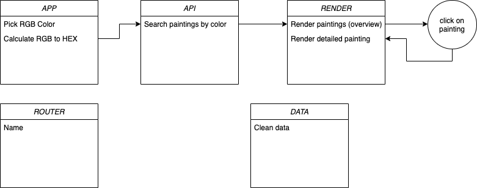

# Web App From Scratch - Marten de Bruijn

## Live Demo

[Live Demo Link](https://martendebruijn.github.io/web-app-from-scratch-1920/)

## Table of contents

## Description

In deze applicatie kan men schilderijen van het Rijksmuseum zoeken bij kleur.

## Goal of the application

Men een andere manier geven hoe zij kunst ontdekken.

## Usage

## API

Bij deze applicatie maak ik gebruik van de API van het Rijksmuseum. Deze API is een set van meer dan 110,000 beschrijvingen en digitale afbeeldingen van kunstobjecten van de collectie van het Rijksmuseum. De kunstwerken dateren van lang geleden tot eind 19e eeuw. Vanwege copyright restricties zijn kunstwerken van de 20e en 21e eeuw niet toegevoegd in deze API.

Om gebruik te maken van de API van het Rijksmuseum heeft men een key nodig. Deze kan men aanvragen bij de gevanceerde account instellingen op de site van het Rijksumseum.
https://www.rijksmuseum.nl/en/rijksstudio/

## Actor Diagram

Onderstaande mijn tijdelijke actor diagram (deze wordt nog aangepast(!))

## Interaction Diagram

## Sources

https://www.rijksmuseum.nl/nl/data

<!-- ## Feature Whislist -->

<!-- Add a link to your live demo in Github Pages 🌐-->

<!-- ☝️ replace this description with a description of your own work -->

<!-- replace the code in the /docs folder with your own, so you can showcase your work with GitHub Pages 🌍 -->

<!-- Add a nice poster image here at the end of the week, showing off your shiny frontend 📸 -->

<!-- Maybe a table of contents here? 📚 -->

<!-- How about a section that describes how to install this project? 🤓 -->

<!-- ...but how does one use this project? What are its features 🤔 -->

<!-- What external data source is featured in your project and what are its properties 🌠 -->

<!-- Maybe a checklist of done stuff and stuff still on your wishlist? ✅ -->

<!-- How about a license here? 📜 (or is it a licence?) 🤷 -->
